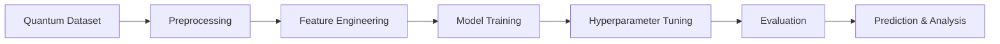

<div align="center">


<br>

<p align="center">
  
</p>

<br>

<p align="center">
  <a href="https://github.com/edwingeorgeshaji">
    
  </a>
  <a href="https://www.linkedin.com/in/edwingeorgeshaji">
    
  </a>
  
</p>

<br>


</div>

---

# Quantum Circuit Error Classification

## Overview

Quantum computers are highly sensitive to environmental noise, decoherence, gate imperfections, and measurement instability. Detecting and classifying these quantum errors efficiently is one of the core challenges in modern quantum computing research.

This project combines Quantum Computing concepts with Machine Learning techniques to classify quantum circuit errors using hardware-inspired metrics and predictive models.

The repository demonstrates a complete end-to-end machine learning workflow including:

* Exploratory Data Analysis
* Data preprocessing
* Feature engineering
* Model training
* Hyperparameter optimization
* Cross-validation
* Model evaluation
* Visualization and insights

---

## Project Objective

The goal of this project is to build an intelligent system capable of predicting and classifying quantum circuit errors using supervised machine learning.

The system analyzes features such as:

| Quantum Parameter | Description                            |
| ----------------- | -------------------------------------- |
| Gate Fidelity     | Accuracy of quantum gate operations    |
| Circuit Depth     | Complexity of the quantum circuit      |
| T1 Coherence Time | Energy relaxation stability            |
| T2 Coherence Time | Phase decoherence stability            |
| Readout Error     | Probability of incorrect measurement   |
| Noise Metrics     | Quantum hardware noise characteristics |

This contributes toward:

* Fault-tolerant quantum computing
* Quantum hardware optimization
* Noise-aware circuit execution
* Intelligent quantum diagnostics
* Quantum error mitigation research

---

## User Interface Preview

<div align="center">


</div>

<p align="center">
  Premium README interface inspired by modern developer portfolio aesthetics and research-grade project presentation.
</p>

---

## Repository Structure

```bash
Quantum-Circuit-Error-Classification/
│
├── quantum-circuit-error-classification.ipynb
├── quantum_circuit_errors.csv
├── README.md
└── LICENSE
```

---

## Machine Learning Pipeline

<div align="center">



</div>

---

## Technologies Used

<div align="center">

| Category         | Technologies        |
| ---------------- | ------------------- |
| Programming      | Python              |
| Machine Learning | Scikit-learn        |
| Data Analysis    | Pandas, NumPy       |
| Visualization    | Matplotlib, Seaborn |
| Development      | Jupyter Notebook    |
| Research Domain  | Quantum Computing   |

</div>

---

## Models Implemented

| Model                    | Purpose                       |
| ------------------------ | ----------------------------- |
| Logistic Regression      | Baseline classification       |
| Random Forest Classifier | Main predictive model         |
| GridSearchCV             | Hyperparameter optimization   |
| K-Fold Cross Validation  | Model generalization analysis |

---

## Features

### Data Analysis

* Statistical summaries
* Correlation analysis
* Distribution visualization
* Feature relationship analysis

### Preprocessing

* Missing value checks
* Label encoding
* Feature scaling
* Data preparation pipeline

### Visualization

* Correlation heatmaps
* Confusion matrix plots
* Feature importance graphs
* Cross-validation analysis

### Prediction System

* Quantum error classification
* Model evaluation metrics
* Performance analysis
* Prediction on unseen data

---

## Installation

### Clone the Repository

```bash
git clone https://github.com/edwingeorgeshaji/Quantum-Circuit-Error-Classification.git
cd Quantum-Circuit-Error-Classification
```

### Install Dependencies

```bash
pip install pandas numpy matplotlib seaborn scikit-learn jupyter
```

### Launch Notebook

```bash
jupyter notebook
```

Open:

```bash
quantum-circuit-error-classification.ipynb
```

---

## Visualizations Included

The notebook contains:

* Feature distribution plots
* Correlation heatmaps
* Confusion matrix visualizations
* Feature importance analysis
* Cross-validation performance metrics

---

## Future Improvements

* IBM Quantum hardware integration
* Deep learning-based error prediction
* Real-time quantum monitoring
* Quantum circuit simulation support
* Interactive dashboard deployment
* Advanced ensemble learning models

---

## Applications

This project can contribute toward:

* Quantum error correction research
* Fault-tolerant quantum systems
* AI-assisted quantum diagnostics
* Quantum hardware analysis
* Noise-aware quantum compilation

---

## Author

<div align="center">


### Edwin George Shaji

Computer Science Engineering Student
Quantum Computing Enthusiast
Machine Learning and AI Developer

<br>

<a href="https://github.com/edwingeorgeshaji">
  
</a>

<a href="https://www.linkedin.com/in/edwingeorgeshaji">
  
</a>

</div>

---

## Repository Analytics

<div align="center">


</div>

---

## Support

If you found this project useful:

* Star the repository
* Fork the project
* Share it with other developers and researchers

---

<div align="center">


</div>
