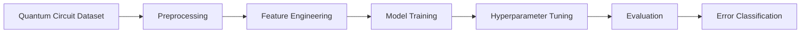

# Quantum Circuit Error Classification

<p align="left">
  
  
  
  
</p>

A machine learning system for detecting and classifying quantum circuit errors using hardware-inspired quantum metrics and predictive modeling.

---

## Overview

Quantum computers are highly sensitive to decoherence, gate imperfections, and environmental noise. This project explores how classical machine learning can be used to classify quantum circuit errors through structured hardware-inspired datasets.

The repository demonstrates a complete machine learning workflow:

* Exploratory Data Analysis
* Data preprocessing
* Feature engineering
* Model training
* Hyperparameter optimization
* Cross-validation
* Performance evaluation

---

## Architecture



---

## Dataset Features

| Feature       | Description                         |
| ------------- | ----------------------------------- |
| Gate Fidelity | Accuracy of quantum gate operations |
| Circuit Depth | Complexity of the quantum circuit   |
| T1 Coherence  | Energy relaxation time              |
| T2 Coherence  | Phase decoherence time              |
| Readout Error | Measurement instability             |
| Error Type    | Target classification label         |

---

## Models Used

| Model                    | Purpose                     |
| ------------------------ | --------------------------- |
| Logistic Regression      | Baseline classification     |
| Random Forest Classifier | Main predictive model       |
| GridSearchCV             | Hyperparameter optimization |
| K-Fold Cross Validation  | Model validation            |

---

## Tech Stack

```text
Python
Scikit-learn
Pandas
NumPy
Matplotlib
Seaborn
Jupyter Notebook
```

---

## Repository Structure

```bash
Quantum-Circuit-Error-Classification/
│
├── quantum-circuit-error-classification.ipynb
├── quantum_circuit_errors.csv
├── README.md
└── LICENSE
```

---

## Installation

### Clone Repository

```bash
git clone https://github.com/edwingeorgeshaji/Quantum-Circuit-Error-Classification.git
cd Quantum-Circuit-Error-Classification
```

### Install Dependencies

```bash
pip install pandas numpy matplotlib seaborn scikit-learn jupyter
```

### Run Notebook

```bash
jupyter notebook
```

---

## Key Features

* Quantum circuit error classification
* Hardware-inspired feature analysis
* Correlation heatmaps and visualizations
* Feature importance analysis
* Cross-validation evaluation
* Hyperparameter optimization

---

## Future Scope

* IBM Quantum hardware integration
* Real-time quantum monitoring
* Deep learning-based classification
* Interactive visualization dashboard
* Advanced ensemble learning methods

---

## Author

**Edwin George Shaji**

Computer Science Engineering Student focused on Quantum Computing, Artificial Intelligence, and Machine Learning.

GitHub:

[https://github.com/edwingeorgeshaji](https://github.com/edwingeorgeshaji)

LinkedIn:

[https://www.linkedin.com/in/edwingeorgeshaji](https://www.linkedin.com/in/edwingeorgeshaji)

---

<p align="left">
  
</p>
